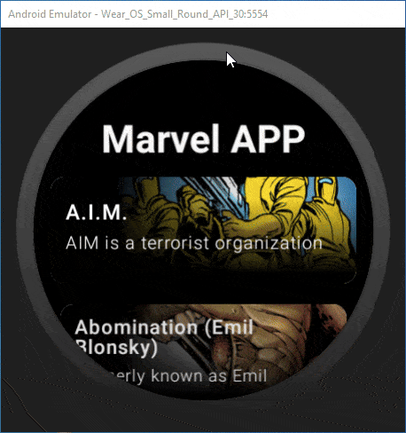

# 🌟 Marvel Multiplatform Project 🌟

Welcome to the Marvel Multiplatform Project! This proof of concept project leverages the power of the Marvel API across multiple platforms, including Android (Mobile, WearOs, Android TV) and Desktop. 🚀

## 📁 Project Structure

* `/shared` - Code shared between all targets.
  * `commonMain` - The most important subfolder for shared code.
  * Platform-specific folders for additional platform-specific code.

* `/composeApp` - Code for Compose Mobile and Desktop.
* `/wearApp` - Code for WearOs.
* `/tvApp` - Code for Android TV.

## 📁 Project Preview

### 📱 Mobile

  

### 🖥️ Desktop

  

### ⌚ WearOs

  

### 📺 Android TV

  

## 🛠️ Technologies Used

- **Kotlin Multiplatform**
- **Ktor**: Networking.
- **SQLDelight**: Local Database management.
- **Koin**: Dependency injection.
- **DataStore**: Local preferences storage.

## 🚀 Getting Started

1. Clone the repository.
2. Open the project in Android Studio.
3. Create a Constants.kt based on Constants.kt.example and add your Marvel API keys.
4. Sync the project with Gradle.
5. Run the project on your desired platform.

## 📚 Learn More

- [Kotlin Multiplatform](https://www.jetbrains.com/help/kotlin-multiplatform-dev/get-started.html)
- [Kotlin Multiplatform Wizard](https://kmp.jetbrains.com/)

## 🎉 Enjoy exploring the Marvel universe across all your devices! 🎉